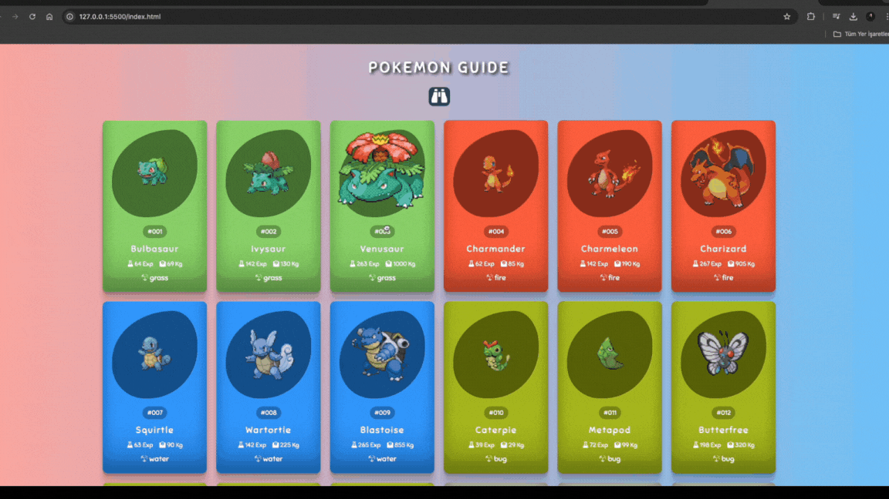

# Pokemon Guide

- This project is a Pokemon card application developed using HTML, CSS, JavaScript, and the PokeAPI. Each card provides essential details about a Pokemon, including its image, ID, name, type, experience points, and weight. The design of the cards is customized with colors specific to each Pokemon type.

## Features

- Pokémon Cards: The webpage displays special cards representing each Pokémon with basic information. The background color of the cards is automatically determined based on the Pokémon's type.

- Search Functionality: Users can filter Pokémon cards by name using the search bar. This feature allows for quick and easy discovery of specific Pokémon cards.

- Dynamic Data Fetching: The PokeAPI is used to retrieve detailed data for each Pokémon. JavaScript fetches this data and dynamically creates Pokémon cards on the page.

- Responsive Design: The layout is fully responsive, ensuring that the application works seamlessly across a variety of devices, from mobile phones to desktop screens.

- FontAwesome Icons: FontAwesome icons are used to visually represent experience points and weight on the Pokémon cards, enhancing both the appearance and the informational aspect of the cards.

## GIF

